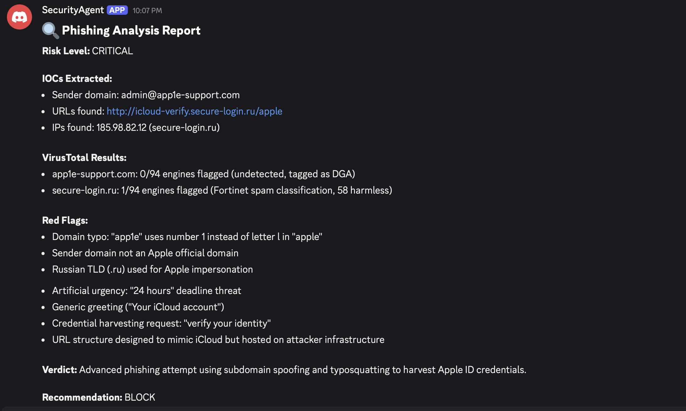
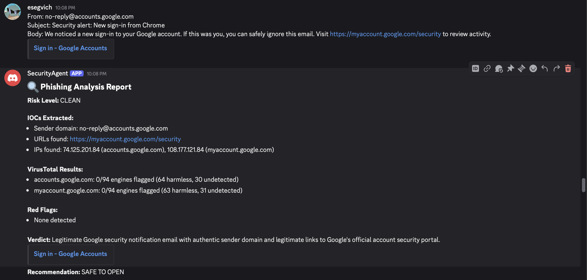

# phishing-analysis-agent


Simulates real-world SOC Level 1 phishing triage by automating IOC extraction, threat enrichment, and risk classification. Built with OpenClaw, Claude Haiku, and the VirusTotal API, paste a suspicious email into Discord and get a structured threat intelligence report in seconds.

## Demo

**Input — suspicious email:**
```
From: support@paypal.com.secure-login.co
Subject: Action Required: Verify Your Account
Body: We detected unusual activity. Please confirm your account immediately:
https://paypal.com.secure-login.co/verify
```

**Output — structured threat report:**

```
🔍 Phishing Analysis Report
 
Risk Level: CRITICAL
 
IOCs Extracted:
- Sender domain: support@paypal.com.secure-login.co
- URLs found: https://paypal.com.secure-login.co/verify
- IPs found: 3.136.18.200 (secure-login.co)
 
VirusTotal Results:
- paypal.com.secure-login.co: 4/94 engines flagged (Fortinet phishing, Google Safebrowsing phishing)
- secure-login.co: 6/94 engines flagged (ADMINUSLabs malicious, CyRadar phishing, Fortinet phishing)
 
Red Flags:
- Subdomain spoofing: uses paypal.com as subdomain of attacker-controlled domain
- Known phishing infrastructure: secure-login.co flagged by 6 threat intelligence engines
- Domain registration privacy via proxy service
- Urgency language: "immediately" + "unusual activity" = credential harvesting tactic
 
Verdict: Confirmed phishing email using established malicious infrastructure to harvest PayPal credentials.
 
Recommendation: BLOCK
```

---

### Live Demo (Discord Bot)








---

## Key Features

- Automated IOC extraction (domains, URLs, IPs)
- Real-time threat enrichment using VirusTotal API
- Risk classification with confidence scoring
- Detection of phishing techniques:
  - Typosquatting
  - Subdomain spoofing
  - Social engineering tactics
- Structured SOC-style reporting output
- Discord bot interface for real-time analysis

---

## How It Works

1. In Discord, you paste a raw email or headers
2. The agent extracts all IOCs — sender domain, URLs, IP addresses
3. It queries the [VirusTotal API](https://www.virustotal.com/) for each domain/URL
4. It combines rule-based analysis with AI reasoning and live threat intelligence to produce a structured report
5. Output always follows a consistent SOC-ready format

This project demonstrates how AI agents can augment SOC analyst workflows — automating the repetitive triage work so analysts can focus on higher-level investigation.

---

## Tech Stack

| Component | Technology |
|---|---|
| Agent framework | [OpenClaw](https://openclaw.ai) |
| AI model | Claude Haiku (Anthropic) |
| Threat intelligence | [VirusTotal API v3](https://developers.virustotal.com/) |
| Interface | Discord (Bot API) |
| Runtime | Node.js |

---

## Security Considerations

- API keys are stored securely using environment variables and are never exposed in agent outputs
- The agent avoids making unverified claims and bases analysis only on observable indicators and threat intelligence data
- Designed to reduce false positives through confidence scoring and multi-factor analysis

---

## Architect Diagram

Discord → OpenClaw Agent → IOC Extraction → VirusTotal API → Report Output

---

## Setup

### Prerequisites
- [OpenClaw](https://openclaw.ai) installed
- Anthropic API key ([console.anthropic.com](https://console.anthropic.com))
- VirusTotal API key ([virustotal.com](https://virustotal.com)) — free tier (500 lookups/day)
- Discord bot token ([discord.com/developers](https://discord.com/developers))

### Installation

1. Install OpenClaw:
```bash
curl -fsSL https://openclaw.ai/install.sh | bash
```

2. Run onboarding with your Anthropic API key:
```bash
openclaw onboard --anthropic-api-key "sk-ant-..."
```

3. Add your VirusTotal key to OpenClaw config:
```bash
nano ~/.openclaw/openclaw.json
# Add "env": { "VIRUSTOTAL_API_KEY": "your-key-here" } at the top
```

4. Configure the agent system prompt:
```bash
nano ~/.openclaw/workspace/AGENT.md
# Paste the system prompt from agent/AGENT.md in this repo
```

5. Start the gateway:
```bash
openclaw gateway start
```

### Usage

In your Discord server, supply the bot with any suspicious email:

```
analyze this email for phishing indicators:

From: security-alert@paypa1.com
Subject: Urgent: Your account has been suspended
Body: Click here to verify: http://paypal-verify.suspicious-domain.xyz/login
```

---

## Agent System Prompt

The agent's behavior is defined in `agent/AGENT.md`. Key instructions:

- Always extract IOCs from raw email text before responding
- Run VirusTotal lookups via curl for each domain and URL
- Parse JSON response for `last_analysis_stats.malicious` and `total`
- Output only the structured report format — no conversational filler
- Correctly identify legitimate emails (returns CLEAN verdict)

---

## Project Context

Developed as a hands-on security engineering project to simulate SOC Level 1 phishing triage workflows. The goal was to explore how AI agents can automate first-level phishing triage and demonstrate practical understanding of:

- Threat intelligence APIs and IOC enrichment
- Phishing indicators: typosquatting, subdomain spoofing, urgency tactics
- AI agent configuration and prompt engineering
- Automating repetitive security analyst workflows
- Designed to avoid overconfidence by incorporating confidence scoring and evidence-based conclusions

---

## Future Improvements

- [ ] Add VirusTotal URL scanning (not just domain lookup)
- [ ] Support raw email header parsing (Received headers, SPF/DKIM/DMARC)
- [ ] Multi-agent setup: Claude (analysis) + GPT-4 (second opinion) for higher confidence verdicts
- [ ] Log all analyses to a SQLite database for trend tracking
- [ ] Slack integration for team SOC environments

---

## Author

Ethan Segvich — Computer Science & Information Systems, University of Vermont '26  
[esegvich.github.io](https://esegvich.github.io) · [LinkedIn](https://linkedin.com/in/ethansegvich)
